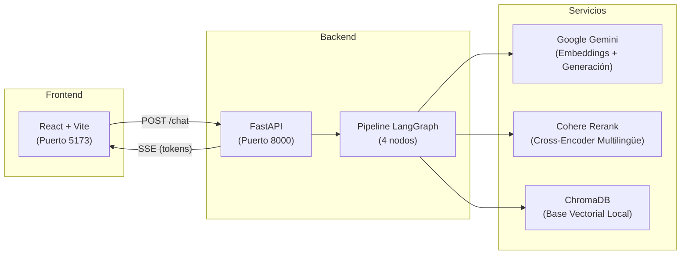
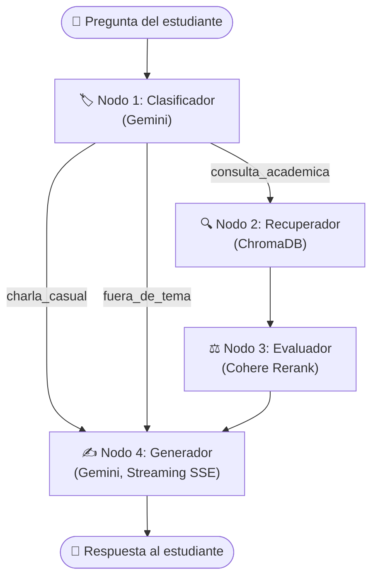

# 🎓 Agente RAG — Instituto Global de Educación Online

Asistente virtual inteligente que responde preguntas de estudiantes del **Instituto Global de Educación Online** utilizando exclusivamente la información contenida en los documentos oficiales del instituto.

El agente implementa un pipeline **RAG (Retrieval-Augmented Generation)** con arquitectura agentica basada en **LangGraph**: clasifica la intención del usuario, recupera fragmentos relevantes de una base vectorial, los reranquea con un cross-encoder multilingüe y genera respuestas en tiempo real con streaming token a token.


---

## 📐 Arquitectura de la Solución

### Diagrama General



### Explicación

| Capa | Componente | Responsabilidad |
|---|---|---|
| **Frontend** | React + Vite | Interfaz de chat, sidebar con documentos, consumo de streaming SSE |
| **API** | FastAPI | Recibe preguntas por `POST /chat`, orquesta el pipeline y devuelve tokens por Server-Sent Events |
| **Orquestación** | LangGraph | Grafo de 4 nodos que procesa la consulta paso a paso (Clasificador → Recuperador → Evaluador → Generador) |
| **Generación / Embeddings** | Google Gemini | `gemini-2.5-flash` para generación de respuestas, `gemini-embedding-001` para vectorización de documentos |
| **Reranking** | Cohere | `rerank-multilingual-v3.0` — cross-encoder que reordena los chunks por relevancia semántica real |
| **Almacenamiento** | ChromaDB | Base de datos vectorial local, persistente en un volumen Docker |

---

## 🔄 Flujo de Consulta



### Paso a paso

1. **Clasificador (Nodo 1):** Gemini analiza la pregunta y la clasifica en una de tres categorías:
   - `consulta_academica` — pregunta sobre reglamento, becas, reembolsos, cursos o certificados.
   - `charla_casual` — saludos, agradecimientos, despedidas.
   - `fuera_de_tema` — cualquier otra cosa no relacionada con el instituto.

2. **Recuperador (Nodo 2):** Solo se ejecuta para `consulta_academica`. Busca los **8 chunks más similares** en ChromaDB usando similitud coseno con los embeddings de Gemini.

3. **Evaluador (Nodo 3):** Recibe los 8 candidatos y los reranquea con el cross-encoder multilingüe de Cohere. Aplica un **umbral de relevancia de 0.25** y conserva los **top 3 chunks**. Si Cohere falla, degrada al orden original del Recuperador sin interrumpir el flujo.

4. **Generador (Nodo 4):** Gemini genera la respuesta final usando un prompt distinto según el tipo de pregunta y la disponibilidad de contexto. La respuesta se transmite **token a token** al frontend vía SSE.

> **Bifurcación clave:** Si la pregunta es `charla_casual` o `fuera_de_tema`, el flujo salta directamente del Clasificador al Generador, sin consultar ChromaDB ni Cohere.

---

## 🛠️ Tecnologías y Herramientas

| Categoría | Tecnología | Versión |
|---|---|---|
| Backend / API | FastAPI | 0.139.0 |
| Backend / API | Uvicorn | 0.50.2 |
| Backend / API | SSE-Starlette | 3.4.5 |
| Orquestación IA | LangGraph | 1.2.8 |
| Orquestación IA | LangChain | 1.3.11 |
| Modelo de Generación | Google Gemini 2.5 Flash | — |
| Modelo de Embeddings | Google Gemini Embedding 001 | — |
| Reranking | Cohere Rerank Multilingual v3.0 | — |
| Base Vectorial | ChromaDB | 1.5.9 |
| Parseo de PDFs | PyMuPDF | 1.24.10 |
| Frontend | React | 18.3.1 |
| Frontend | Vite | 5.4.1 |
| Contenedores | Docker Compose | 3.8 |

---

## 🌐 Demo en Vivo

> **URL pública:** _Próximamente — deploy en proceso._

<!-- Reemplazar la línea de arriba con el link real una vez hecho el deploy, por ejemplo:
> **URL pública:** [https://tu-dominio.com](https://tu-dominio.com)
-->

---

## 📄 Documentos Indexados

El agente trabaja con un corpus cerrado de 4 documentos oficiales del Instituto Global:

| Documento | Descripción |
|---|---|
| `FAQ_Cursos_y_Certificados.pdf` | Preguntas frecuentes sobre cursos, certificaciones y notas de aprobación |
| `Politica_de_Reembolsos.pdf` | Política de reembolsos, plazos y condiciones |
| `Programa_Becas_y_Afiliados.pdf` | Información sobre becas, requisitos de promedio y programa de afiliados |
| `Reglamento_del_Estudiante.pdf` | Reglamento académico, normas de conducta y sanciones |

Los documentos se procesan con una **estrategia de chunking híbrida**:
- **Por sección:** Si el PDF tiene encabezados reconocibles (capítulos, secciones numeradas), se fragmenta respetando la estructura del documento.
- **Genérico:** Si no se detecta estructura, se aplica fragmentado por tamaño fijo (1000 caracteres, 200 de overlap).

---

## 📁 Estructura de Archivos

```
Instituto_Global-Agente_RAG/
├── backend/
│   ├── agente/
│   │   ├── graph.py              # Ensamblado del grafo LangGraph (4 nodos)
│   │   ├── nodes.py              # Implementación de cada nodo del pipeline
│   │   ├── state.py              # Estado compartido del agente (TypedDict)
│   │   └── eval_agente.py        # Script de evaluación con casos de prueba
│   ├── ingesta/
│   │   └── procesar_pdfs.py      # Ingesta de PDFs → ChromaDB (chunking híbrido)
│   ├── main.py                   # App FastAPI + endpoints (SSE, documentos)
│   ├── requirements.txt          # Dependencias Python
│   └── Dockerfile
├── frontend/
│   ├── src/
│   │   ├── App.jsx               # Componente principal de la aplicación
│   │   ├── App.css               # Estilos globales
│   │   ├── main.jsx              # Entry point de React
│   │   └── components/
│   │       ├── ChatArea.jsx      # Área de chat con streaming de tokens
│   │       ├── Sidebar.jsx       # Sidebar con lista de documentos
│   │       └── PdfModal.jsx      # Modal para visualizar PDFs
│   ├── package.json
│   └── Dockerfile
├── documentos/                   # Corpus de 4 PDFs del instituto
├── docker-compose.yml            # Orquestación de los servicios
└── README.md
```

---

## 🚀 Instrucciones para Ejecutar el Proyecto

### Prerrequisitos

- [Docker](https://docs.docker.com/get-docker/) y Docker Compose instalados
- API Key de **Google Gemini** → [Obtener aquí](https://aistudio.google.com/apikey)
- API Key de **Cohere** → [Obtener aquí](https://dashboard.cohere.com/api-keys)

### Pasos

1. **Clonar el repositorio:**
   ```bash
   git clone https://github.com/tu-usuario/Instituto_Global-Agente_RAG.git
   cd Instituto_Global-Agente_RAG
   ```

2. **Crear el archivo de variables de entorno** `backend/.env`:
   ```env
   GOOGLE_API_KEY=tu_clave_de_google_aquí
   COHERE_API_KEY=tu_clave_de_cohere_aquí
   FRONTEND_URL=http://localhost:5173
   ```

3. **Levantar los servicios con Docker Compose:**
   ```bash
   docker compose up --build
   ```

4. **Acceder a la aplicación** en el navegador:
   ```
   http://localhost:5173
   ```

> **Nota:** La primera vez que se levanta el proyecto, el backend procesa los 4 PDFs y genera los embeddings automáticamente. Esto puede tardar unos segundos. Las ejecuciones siguientes detectan que ChromaDB ya tiene datos y saltan la ingesta.

---

## ❓ Ejemplos de Preguntas

### Consultas académicas
- ¿Cuántos días tengo para pedir un reembolso completo desde que empieza el curso?
- ¿Qué promedio necesito para no perder mi beca?
- ¿Cómo funciona el programa de referidos?
- Si me voy de vacaciones un mes, ¿puedo pausar el tiempo de mi curso y retomarlo a la vuelta?

### Charla casual
- ¿Quién eres y qué puedes hacer?

### Fuera de tema
- ¿Cuál es la capital de Argentina?

---

## 💬 Ejemplos de Respuestas

### Respuesta a una pregunta fuera de tema


### Respuesta a una consulta académica (con citas)


